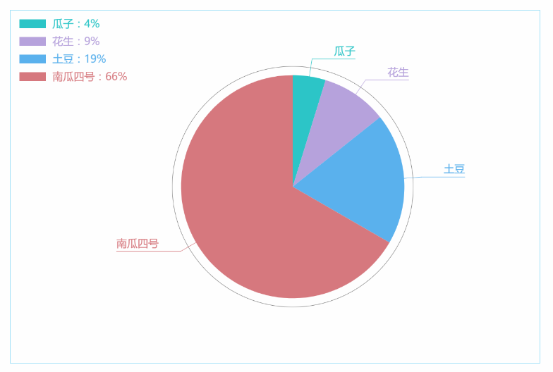
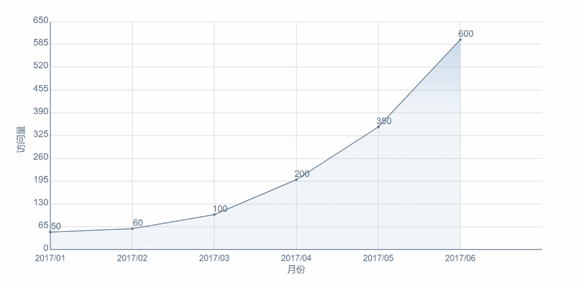
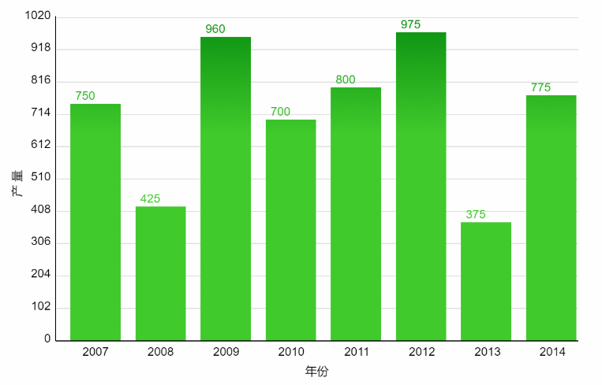
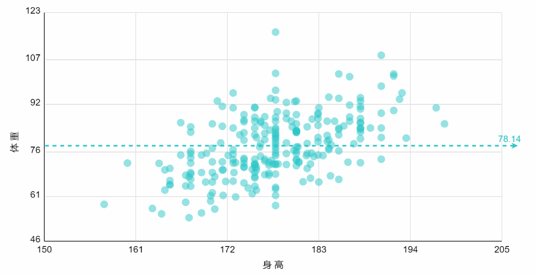
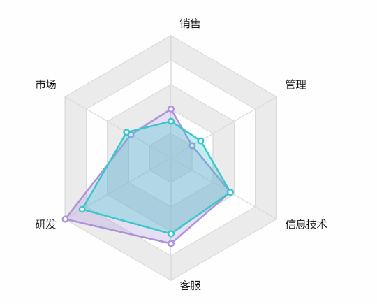
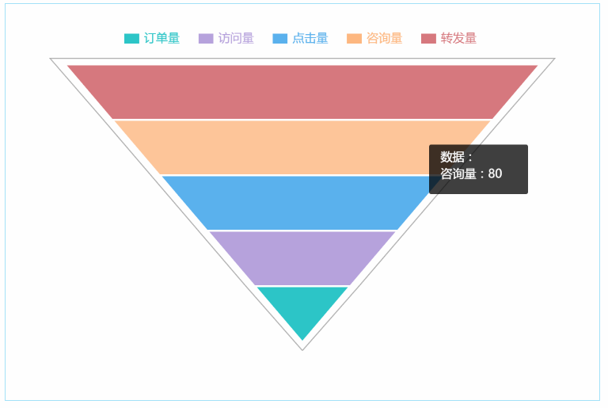
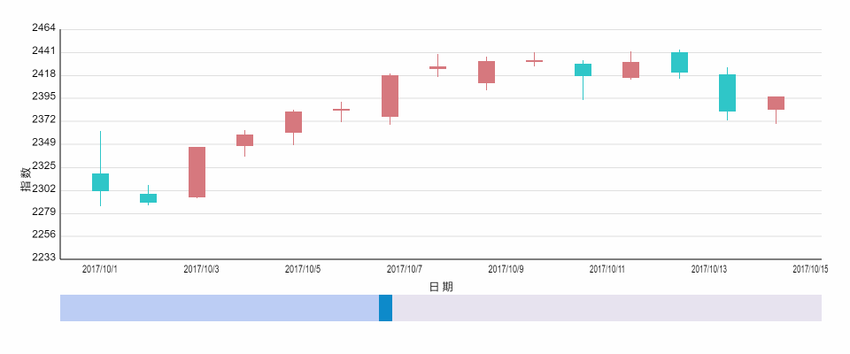

# charts
各种cavas图表的绘制（点击下面列表文字跳转到演示页面）

## 已更新：

+ [饼状图（点击文字跳转到演示页面）](https://sutianbinde.github.io/charts/%E9%A5%BC%E7%8A%B6%E5%9B%BE-%E9%AB%98%E6%B8%85.html)
  
+ [线状图/折线图](https://sutianbinde.github.io/charts/%E6%8A%98%E7%BA%BF%E5%9B%BE-%E9%AB%98%E6%B8%85.html)
  
+ [柱状图](https://sutianbinde.github.io/charts/%E6%9F%B1%E7%8A%B6%E5%9B%BE-%E9%AB%98%E6%B8%85.html)
  
+ [散点图](https://sutianbinde.github.io/charts/%E6%95%A3%E7%82%B9%E5%9B%BE-%E9%AB%98%E6%B8%85.html)
  
+ [雷达图](https://sutianbinde.github.io/charts/%E9%9B%B7%E8%BE%BE%EF%BC%88%E9%9D%A2%E7%A7%AF%EF%BC%89%E5%9B%BE-%E9%AB%98%E6%B8%85.html)
  

+ [漏斗图](https://sutianbinde.github.io/charts/%E6%BC%8F%E6%96%97%E5%9B%BE-%E9%AB%98%E6%B8%85.html)
  

+ [k线图](https://sutianbinde.github.io/charts/k%E7%BA%BF%E5%9B%BE-%E9%AB%98%E6%B8%85.html)
  
